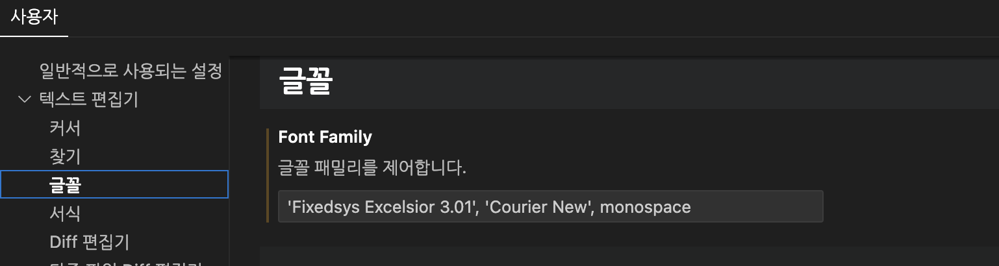
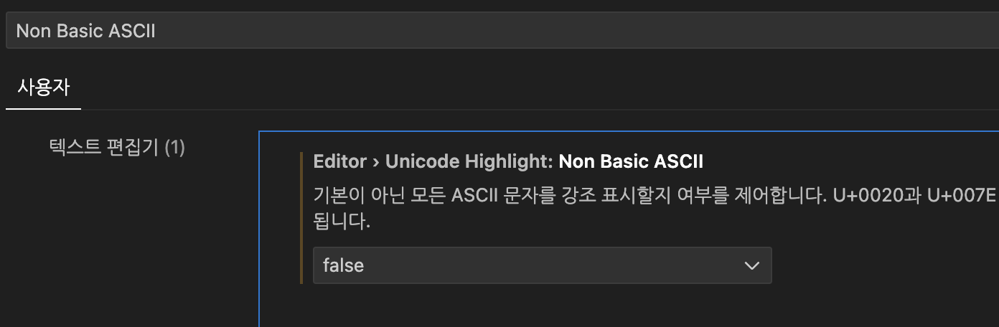

# TextEditor Config
~~~
- 텍스트 편집기 메뉴 기준
- 설정창 열기 "Ctrl + ," 또는 "command + ,"
~~~
 

## 폰트 변경하기
- 폰트 다운로드 (fonts 디렉토리 참고)
- 다운로드 받은 포트 실행하여 "설치" 및 "글꼴 이름" 복사
- VSCode에서 "Ctrl + ," 명령으로 설정창 실행
- "텍스트 편집기" -> "글꼴 선택" 또는 "Font Family"로 검색하여 "Editor:Font Family" 항목을 찾는다.
- "Font Family" 항목의 앞 부분에 "'복사한 글꼴 이름'" 추가 (여기서는 'Fixedsys Excelsior 3.01' 글꼴 추가)

- 열려있는 모든 VSCode 종료 후 다시 실행
 

## 한글에 노란색 네모칸 표시 끄기
- VSCode에서 설정창 실행 ("Ctrl + ," 또는 "command + ,")
- "Non Basic ASCII"로 검색
- "Unicode Highlight: Non Basic ASCII" 항목을 false로 설정

 
